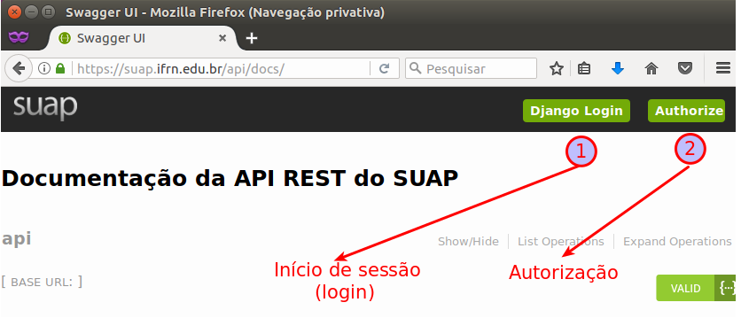

# API do SUAP
Clientes para acesso à API do SUAP

Códigos disponíveis em:
* [Python](python/)
* [Java (JSP)](java/jsp)

Antes de executar o código, você precisa obter *token* e *autorização* via SUAP. Acesse à URL https://suap.ifrn.edu.br/api/docs e siga os passos da imagem abaixo.

